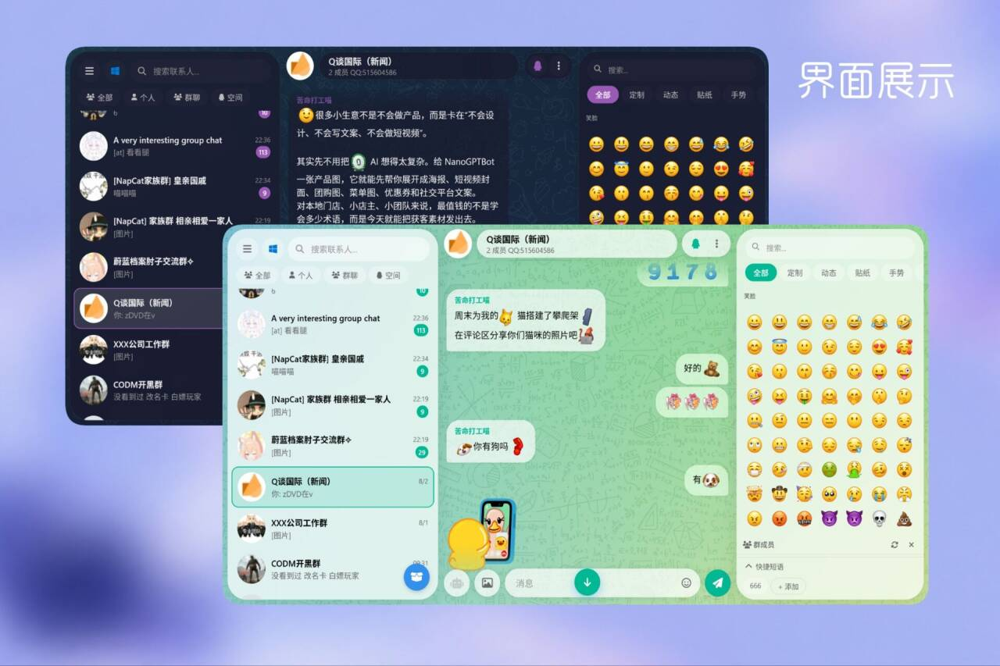
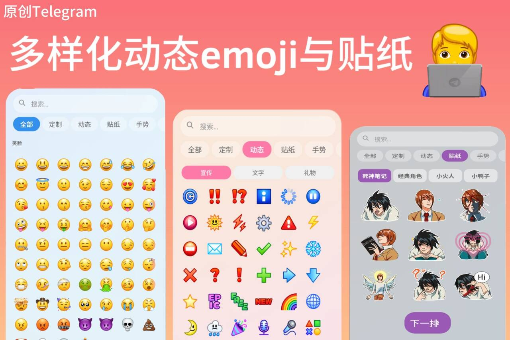
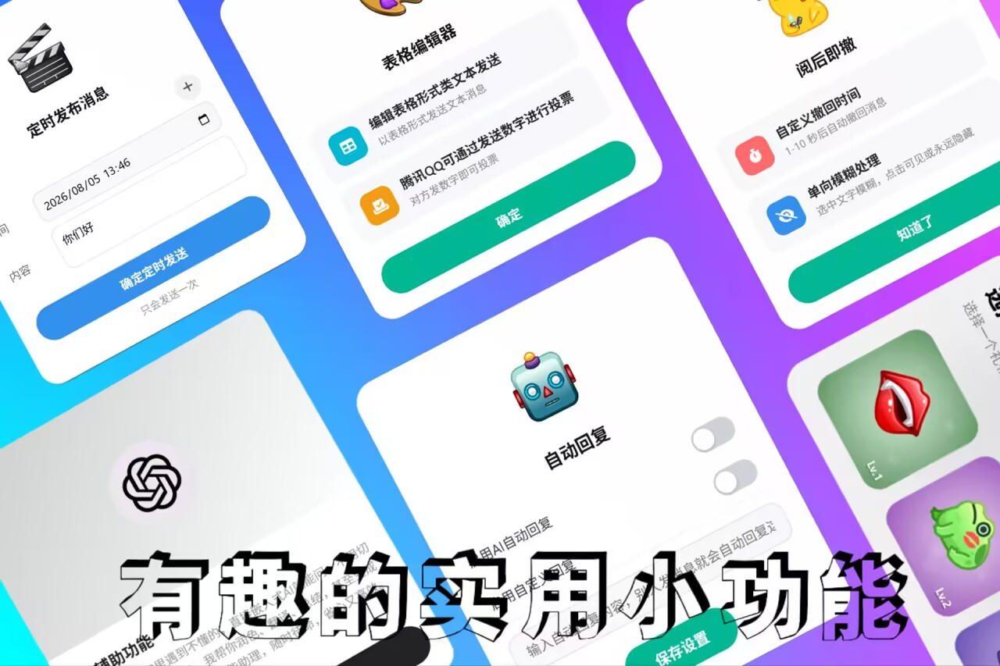
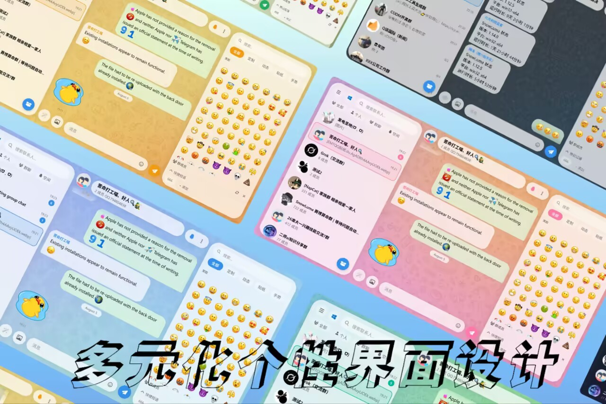

  

<h1 align="center">EMT·QQ</h1>

  <b>仿 Telegram 极简风格的 QQ 网页客户端 —— 聊天，本该如此优雅。</b>

---

## 📢 关于本仓库

本项目采用**混合开源模式**：

- **后续不会公开全部源代码**——由于项目涉及第三方协议层组件（NapCat）与界面框架（Stapxs QQ Lite），且近期收到较多关于版权与合规的关切（如"腾讯是否会追究侵权"等），为稳妥起见，**本仓库不直接公开完整源码，不提供成品发布**；
- **仅作技术交流**——仓库当前定位为技术分享与学习交流平台；
- **后续将发布技术性内容**，包括但不限于：
  - 如何实现"秒切 QQ 号 · 双重身份"这类效果
  - 如何将提取到的 TGS 文件流畅运行于 Web 网页端
  - 第三方客户端制作的教学内容与框架讲解

感谢大家的关注与支持。技术无罪，边界在心——我们只做学习与探索。

---

## ✨ 特性一览

- **🎨 仿 Telegram 极简设计** — 毛玻璃质感、圆角气泡、纯净配色，中心面板通透无遮挡
- **⚡ 丝滑流畅** — 动态表情、贴纸、消息动画轻量优化，滚动跟手、切换零等待
- **😀 超 1000 款动态 Emoji** — 收录 1069 个 Telegram 同款 TGS 动态表情，全矢量动画
- **🖼️ 海量动态贴纸** — 经典角色、小鸭子、死神笔记、小火人四大系列，发送即播放
- **🎨 个性定制** — 8 套主题配色 × 多张精选壁纸 × 浅色/深色/夜间三重视觉模式
- **🔧 进阶功能** — 双账号身份切换、阅后即撤、AI 润色、定时发送、表格投票等

## 📸 界面展示

---

## ⭐ 支持项目

如果你觉得这个项目有意思，欢迎点个 ⭐ Star 支持一下！你的关注是我们持续分享技术内容的动力。

## 📄 免责声明

本项目仅供学习交流使用，所有动态表情、贴纸、壁纸等素材版权归原作者所有。如涉及侵权，请联系删除。

请遵守腾讯 QQ 用户协议及所在地区法律法规，本项目与腾讯公司无任何关联。
